[Using the app](README.md) › Booth

# Booth

The Booth is where you record. It shows the chapter's text large, follows your voice through it with a local speech engine, and
starts and stops the take in your DAW (or the built-in recorder). It needs an [imported manuscript](production.md#importing-the-manuscript).
Open it from **Booth** in the navigation, or from **Record in Booth** on a chapter or credits card on [Script](script.md), which
opens it on that chapter. What the Booth is reading is part of its address (`/booth?chapter=…`, `/booth?credits=opening`), so Back
and a link land on the same chapter. The Booth fills the window and follows the app's theme, light or dark.
While the chapters are being read, the Booth draws its top bar, text, side panel and footer as grey blocks, and the text appears in their place. If the chapters cannot be read, the page says so instead. A link to a chapter the list does not have shows the same blocks with the Booth title, **Checking this link…** and **Go to Production** (Escape also leaves) while the chapter list is read once more.

## The page

The top bar holds the chapter stepper (previous chapter, the chapter menu with the opening and closing credits, next chapter),
where you are (`¶ 1 of 24 · 0% · ~13:48 finished left`), the resume line, and a chip naming the recording setup (the DAW, or the
built-in recorder). The chip opens [Settings](settings.md). The chapter is named as the manuscript heads it
(`CHAPTER I. Down the Rabbit-Hole`). **Text settings** chooses the font, the same choice as the reader font on
[Script](script.md), and the Booth's text size, 24 to 72 px; **+** and **-** change the size too, and the Booth opens at the size
you last chose. The button at the right shows or hides the side panel, and is drawn pressed while the panel is open; in a window 1280 pixels wide or narrower the panel is a
drawer that starts closed, the chapter picker is narrower, and the top bar wraps onto a second row when it runs out of room.

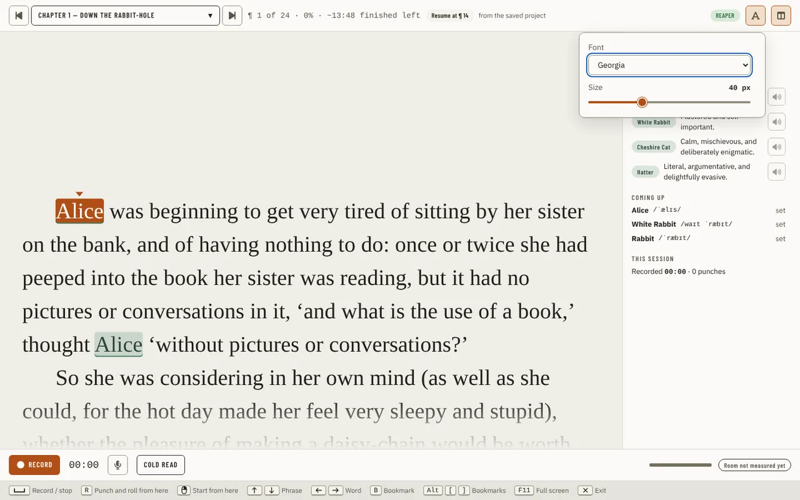

The chip says when the project's DAW is not ready: **REAPER · not linked**, **REAPER · not running**, or REAPER on
its own once connected. Click it to fix that in [Settings](settings.md#link-your-reaper-project).

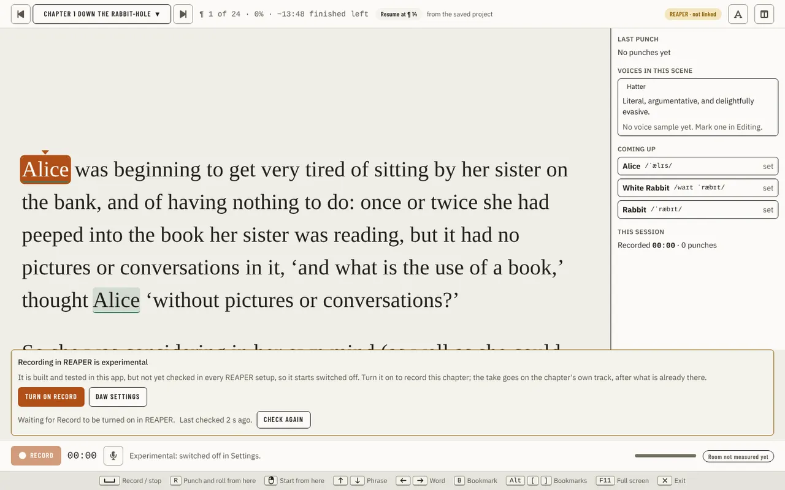

The text fills the middle, fading into the page at the top and bottom edges, with speaker chips beside the lines a character speaks, Story Bible names tinted and the words you
marked on [Script](script.md) drawn in their mark's colour and the line style you chose for it (a tint, a box, or a solid, double,
dotted or wavy underline), as they are on Script; a mark's note shows under its paragraph with a bar in the mark's colour. A
speaker chip takes its character's colour; a suggested speaker's chip is dashed, and a quote nobody is matched to has a grey dashed
**?** chip. A Story Bible name is tinted in its type's colour here, in the side panel's Reference chip and in the **In this
chapter** chips alike. Paragraphs sit one line apart, as the lines inside them do, and each starts with an indent, so a page of short paragraphs or
back-and-forth dialogue shows many more lines at the same text size. The word you
are on is marked with a caret; the text scrolls to keep it in view as you read. The mouse wheel and Page Up and Page Down move
the view without moving your place.

### Finding text in the chapter

**Ctrl+F** opens the jump menu, as on every page. Type two or more letters and the matches in the chapter on screen are listed under **In this chapter**, each with the words around it and its paragraph (**¶ 12**), the same search as on [Script](script.md). Choosing one marks every match in the text, rings the one you chose, and moves your place to it. While a take is recording your place belongs to your voice, so choosing a match only scrolls the text there and the recording is not disturbed; the text returns to your place when you click a word or step, as after the mouse wheel. While a search shows, the jump menu also offers **Next match**, **Previous match** and **Clear the search**.

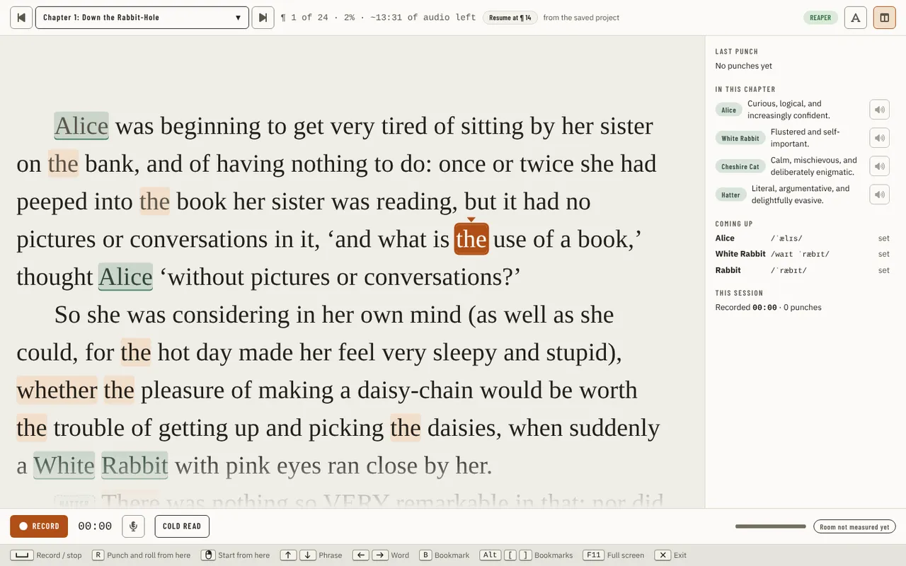

Clicking a Story Bible name, a marked word or a note shows it in the side panel's **Reference**, read-only: the entry, or the
mark with its note and its replies. A click on another word or on empty space clears it. The side panel also has the suspected
lines of this take, **Last punch**, **In this chapter** (the characters the chapter names or gives lines to, in the order they first appear, with their voice notes and their
[voice samples](#voice-samples)), **Coming up** (the next names with a pronunciation) and **This session** (how long you have recorded and
how many punches). In a [pickup session](#a-pickup-session) the pickup lines come first.

The footer has **Record**, the take's timer, **Levels** (the microphone in use and two sliders), a level bar and the room tone
the recorder reports for that microphone (**Room not measured yet** until it reports one), and the keys the Booth answers, drawn
from your keymap. In **Levels**, **Monitor level (output)** sets how loud the DAW plays back to you (0 to 100, 70 is its normal
level; REAPER's first hardware output, so the files you render are not changed). **Input level** is shown but off, with the reason:
no DAW can set an audio interface's input gain, so set it in your interface's own control panel.
With a DAW, **Punch pre-roll (seconds)** sets how long before the word **R** starts the DAW (0 to 10, in half seconds). It applies to every project on
this computer. It is a shortcut to the same setting as **Punch pre-roll** under **Set on a page** in [Settings](settings.md#set-on-a-page), which keeps it too. The built-in recorder does not punch, so the menu has no such box.

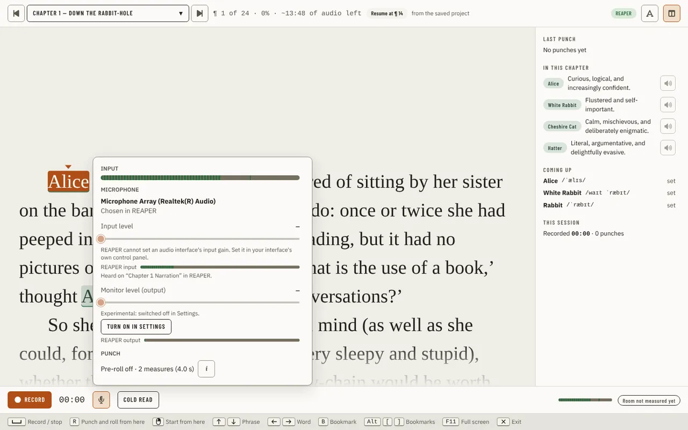

## Recording

Press **Record** (or Space, or a foot pedal mapped to Space) to start a take, and again to stop it. Record arms only the chapter's
track and starts at the end of the last item on it, so a take never records over an earlier one. When Record cannot start it is
disabled and the footer says why, in the DAW's own words: the DAW is not running, the record action is switched off in Settings,
the chapter has no track, or the DAW is already playing. When the reason is a missing or doubled track link, the footer also
offers **Open the audio engine panel**, where **Chapter links** sets the chapter's track.

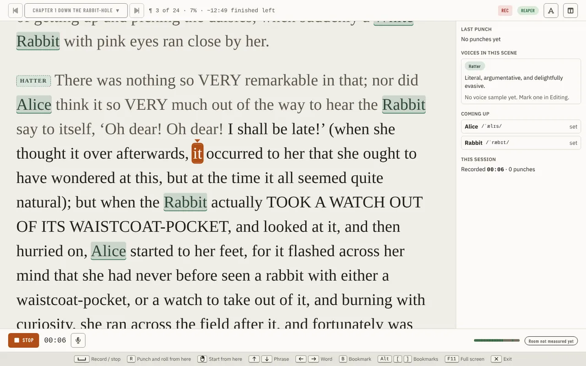

When the reason is one you can fix from the Booth, a box above the footer shows the steps:

- **Recording in REAPER is experimental.** Recording in a DAW starts switched off until it has been checked in that DAW.
  **Turn on Record** turns it on for this computer (Settings > Recording & DAW > Capabilities > Record), and Record is ready at once.

  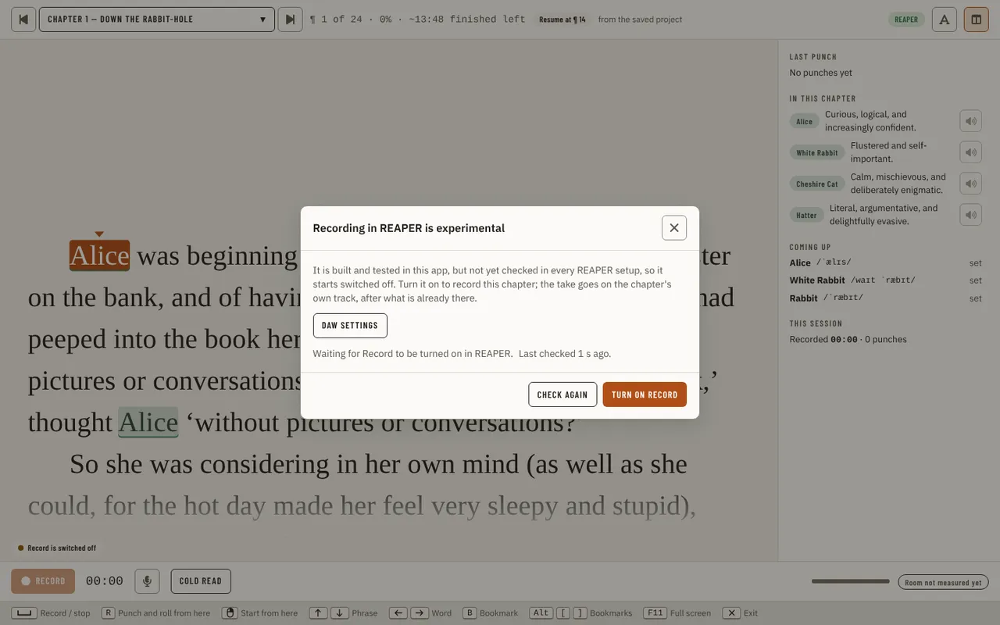

- **Connect REAPER to record** (or **REAPER is not answering**). The app records in REAPER through a small script, the
  launcher, that runs inside REAPER. Load it once: in REAPER, choose **Actions > Show action list > New action > Load
  ReaScript** and pick the launcher file the box shows (**Copy path** copies it). Load it again after you update the app,
  because the file moves with each update. Then, with the chapter's project open in REAPER, run
  **Script: NarrationStudio_Launcher.lua**. The app connects and Record turns on. **Open in REAPER and
  connect** opens the linked project with the launcher in one go, or connects the REAPER you already have open, and from then on Launch REAPER always starts it. If no
  REAPER project is linked yet, the first step links it.

  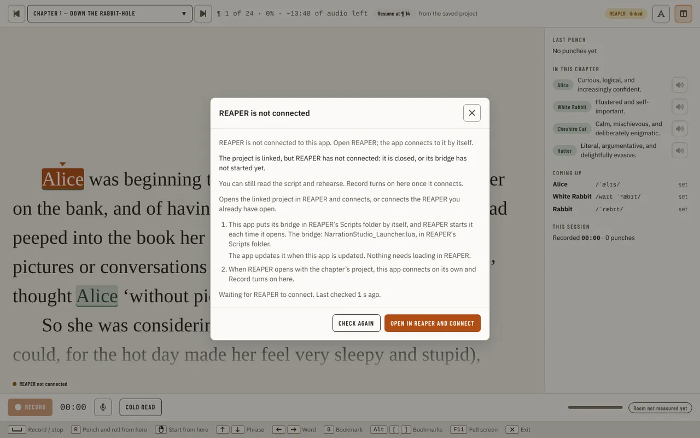

  Both boxes say what they are waiting for ("Waiting for REAPER to connect") and when the app last looked ("Last checked 4 s
  ago"). The Booth asks again by itself every few seconds while it waits, when you come back to its window, and when you press
  **Check again**. If REAPER stops answering, the box says so instead of showing an old answer as fact. In a short window the
  steps fold into one line, **Steps to connect**, so the text keeps room to read.

  If the app is busy (an import, a build or a download is running) when REAPER starts and hands over its project, the app
  keeps the project it has and says so, in the box and in a message that stays until you dismiss it. Finish or cancel what is
  running, then press **Open in REAPER and connect** again.

  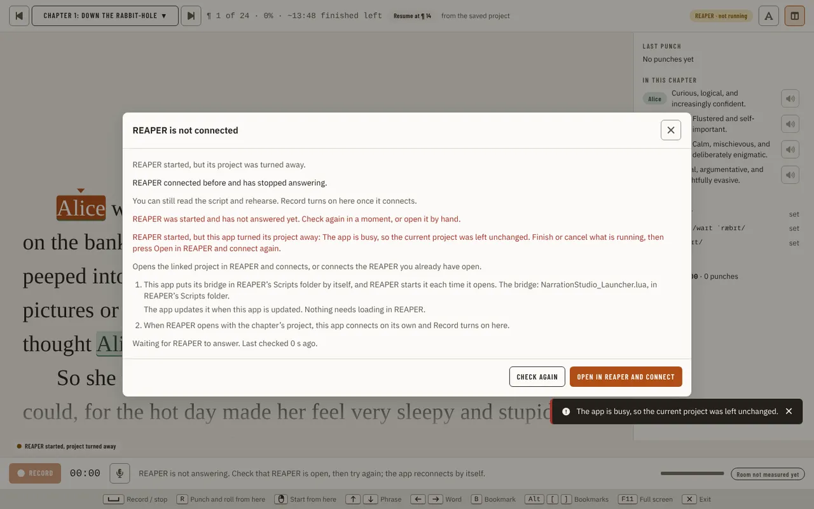

- **REAPER has a different project open.** REAPER answers, but the project it has open is not the one linked here, so a take
  would not land where the book expects it. **Link the open project** opens the project picker (choose the file REAPER has
  open); or open the linked project in REAPER and press **Check again**. The Booth also asks again every few seconds while the
  box is up, and by itself every 15 seconds otherwise, because REAPER sends no message when another project is opened.

  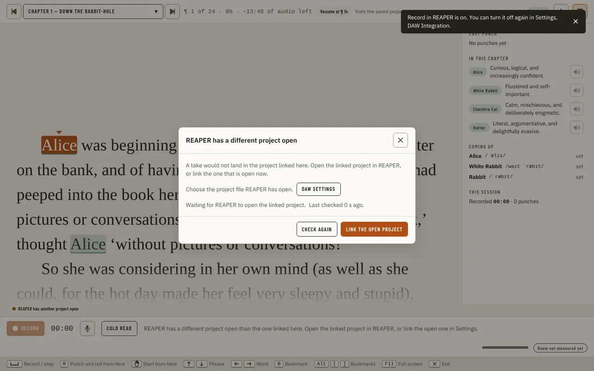

  Record also says why when REAPER already has a take running that the app did not start ("REAPER is already recording. Stop
  it in REAPER before recording here.") and when REAPER does not answer. It is ready again as soon as that is fixed, without a
  restart.

  A message is never drawn over these boxes: it rises above them. The same sentence is one message however often it is asked
  for, and a message about REAPER starting goes as soon as Record is ready.

### Recording without a DAW

A project can record with the built-in recorder instead of a DAW: choose it in [Settings](settings.md) > Recording. It records on
Windows only. The setup chip reads **Built-in**, Record needs no track or DAW project, and each take is saved as a new audio file
in the project's `Recordings` folder (`Take 001.wav`, `Take 002.wav`, …); an earlier take is never overwritten.

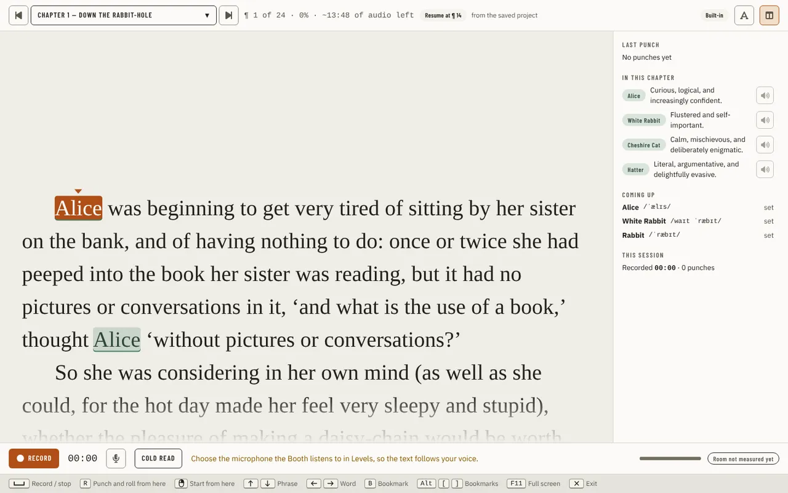

- **Experimental.** Like recording in a DAW, it starts switched off until it has been checked on your microphone. The box above
  the footer says so and **Turn on Record** turns it on, the same switch as in Settings > Recording & DAW > Capabilities > Record.

  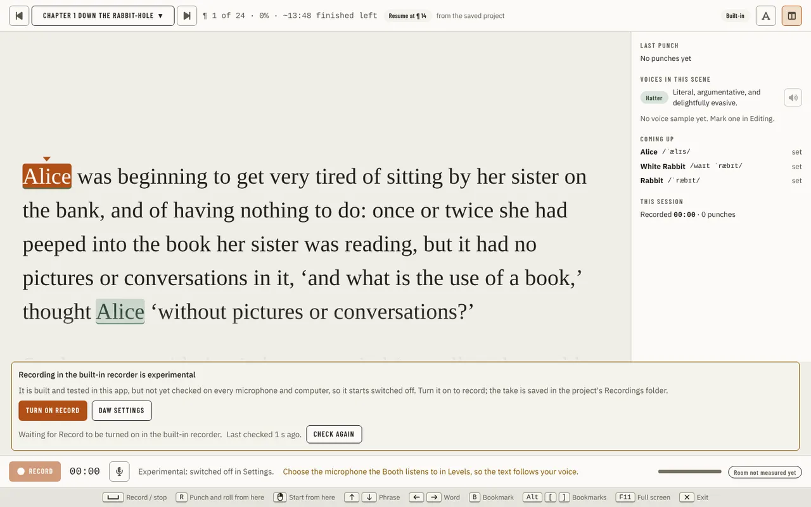

- **The microphone.** The take records on the microphone you chose in **Levels**. With none chosen it uses the one the project
  last recorded with, then the only one the computer lists. With several listed and none chosen, Record says **Choose the
  microphone in Levels, then press Record**; with none listed it says **No microphone found** and why. A microphone Windows
  will not let the app open (another program has it, or the privacy setting blocks it) is refused in the recorder's own words and
  nothing records.
- **A take.** Record becomes **Stop** and the **REC** pill shows, as with a DAW.

  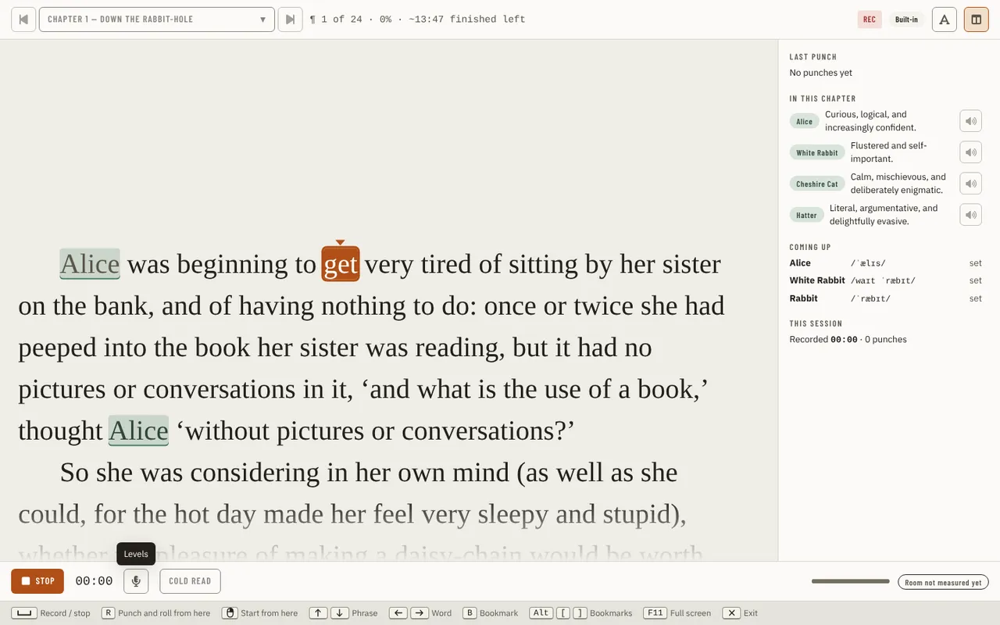

- **A take that ends by itself.** If the microphone is unplugged or the disk fills, the take stops and a message says why and
  that the audio before it is kept in the `Recordings` folder (a take cut short keeps a `.partial` name and is listed as
  unfinished). Record is ready for the next take.

  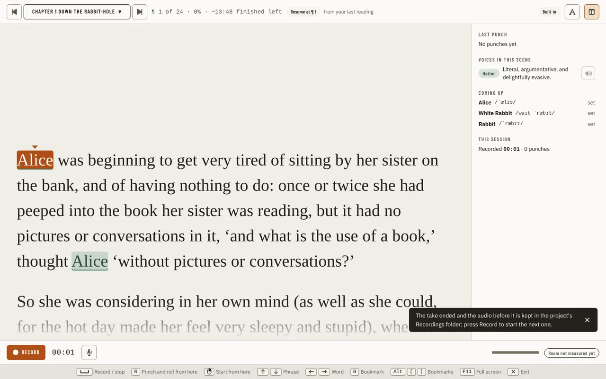

- **Leaving.** Leaving the Booth during a take asks "Stop recording?", as with a DAW. Reloading the window during a take picks the
  take up again, and Stop still stops it. Turning Experimental off during a take does not stop the take, and Stop still works.
- **Not yet.** **R** (punch and roll) is not available with the built-in recorder, and the footer's Levels cannot set an audio
  interface's input gain: set it in the interface's own control panel.
- **Where the takes go.** The Booth does not link a take to its chapter. Assign it in the native takes of the
  [chapter view of Proof](proof.md#the-chapter-view), which is also where the keeper is chosen.

If you stop a take in the DAW itself, the Booth sees it and says so, and Record is ready for the next take. If REAPER stops
answering mid-take, the Booth says it can't tell whether the take is still running, and to check REAPER, instead of keeping a REC
pill it cannot vouch for. Another project opened in REAPER mid-take does not stop the take; the footer says what changed.

While a take runs, Record becomes **Stop**, a **REC** pill shows beside the setup chip and the timer counts. The timer is the
clock's: a window that slept or sat in the background shows the true time when you look at it again. A question that holds the
reading ("Stop recording?", a menu) does not stop the DAW: the pill then says **REC · reading paused** and the timer goes on. The
chapter cannot be changed until you stop, and the chapter arrows and the chapter list say so when you hover or focus them. A screen reader hears nothing when a take starts, so the Booth never speaks into an open microphone (turn on **Start tone** in [Settings](settings.md) for a beep before each take); once the take stops it says "Stopped. Recorded 00:42." When listening reaches the last word of the chapter and stops, the take stops with it and a message says
**Take saved**. Reading on past the end keeps the take running.

**R** punches and rolls from the word you are on: the DAW plays in from a little before it and records from there, keeping the
earlier audio as a take. Pressed again within a moment, it rolls once, not again. Where the DAW would replace the audio instead (Audacity without backups), the Booth asks first ("Roll
again from ¶ n?") and holds the take while it asks.

Click a word to start from it. **↑** and **↓** move by phrase, **←** and **→** by word, **=** and **-** change the text size, and
**F11** takes the window full screen. Hold an arrow and the reading position keeps travelling; Record and Stop (**Space** and the foot pedal) act once, however long they are held. A press on Stop within a second of the take starting (a double click) is ignored, and the Booth says "Recording just started. Press Stop again in a moment if you meant to stop."

Right-click the text for **Start from here** (on a phrase), **Bookmark here** (on a word), **Next phrase**, **Back one phrase**,
**Punch and roll**, **Larger text**, **Smaller text** and **Exit Booth**. **Start from here** marks where the next take starts;
during a take it rolls again from that phrase, as **R** does. A take is held while the menu is open.

While a popover or a menu is open (Levels, Text settings, a speaker, the chapter list, a right-click menu), a foot pedal's Space still starts or stops the take: it closes the popup, as Escape would, and records. The exception is a box you can type in (the speaker search): Space types a space there until focus moves. A question ("Stop recording?") or the jump menu keeps every key, Space included, until you answer it. Escape closes the one on top and returns you to the control that opened it.

The engine and model the Booth listens with are chosen in [Settings](settings.md) › Booth. Nothing you say is sent anywhere.

### The microphone the Booth listens to

The text follows your voice through a microphone of its own choosing. With a DAW, the Booth listens to the microphone the DAW
records from when the DAW names it, and **Levels** shows its name with **Chosen in** and the DAW's name. When the DAW cannot say,
**Levels** lists the microphones on this computer with the DAW's reason, and the footer says **Choose the microphone the Booth listens
to in Levels**. A microphone you chose is never replaced. The choice is remembered for every project.

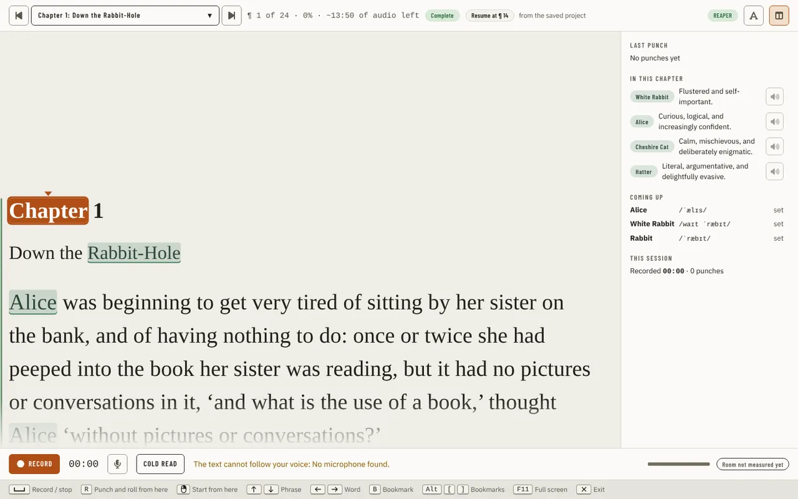

If the speech model is not downloaded yet, the footer says so before you press Record ("The text cannot follow your voice yet"),
and the first take asks to download it, says how large it is and where it goes, and
downloads nothing until you press **Download model**. While the text cannot follow (no microphone listed, or the listening failed
to start), the footer says why. The text starts following your voice before the DAW records, so a take never begins with the text unable to follow: if listening fails to start, nothing is recorded and the Booth says why.

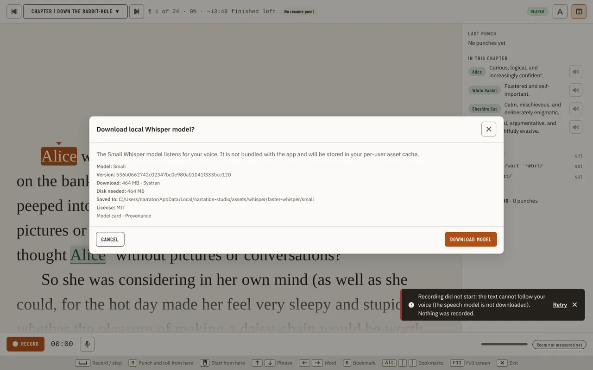

## Where the Booth opens in your DAW

When your DAW is connected and following is on, the Booth and the DAW stay together at the start:

- **Opened with no chapter** (from the sidebar, say): the Booth opens on the chapter you last left in this project, at the word you left it on (see [Where you stopped](#where-you-stopped)). With none kept, or the chapter gone from the book, it opens on the chapter whose track is selected in the DAW; with no track selected, several selected, or a track no chapter is linked to, it opens where it would have.
- **Opened at a chapter** (from the Script, Pickups or a bookmark): the DAW goes to that chapter's track as well. With only a chapter, its cursor goes to the end of the track; with a line, to that line's place in the track, so you can punch from it.
- **Start from here** and **Punch and roll** from a line move the text there, move the DAW's cursor to that spot, and start recording from it, so you never have to find the place in the DAW with the microphone live.

The DAW may still be connecting when the Booth opens; the Booth asks for about twenty seconds and then stays where it is. A DAW that cannot follow is left alone without a message.

## Where you stopped

The Booth keeps the chapter and the word you were on, per project, on this computer. Open it from the sidebar and it returns to that place; leaving a chapter by the picker keeps the new chapter instead. A chapter named by a link (from Script, Pickups or a bookmark) wins over the kept place. If the browser's storage is blocked the Booth opens as before.

When the chapter's track already has a recording, the top bar offers **Resume at ¶ n** and says where it read that from: the
DAW now, the saved project, or the Booth's own record of your last reading. Choosing it moves your place to where the recording
ends; nothing starts until you press Record.

## Voice samples

A voice sample is a stretch of your own recording that you marked in [Editing](editing.md#marking-a-voice-sample) as how a character
sounded; the [Story Bible](story-bible.md#voice-samples) lists them. The Booth lets you hear one without leaving the text, so you can sound the same
in chapter 19 as in chapter 3.

- **Speaker picker.** Press a speaker chip. The characters who speak in this chapter are listed first under **In this chapter**, then
  **Everyone else**. A character with samples shows how many, and a play button at the right of the row plays its primary sample (the starred one in the
  Story Bible); a character with none says "no sample". The picker has the arrow keys now: **Up** and **Down** move the highlighted row and
  **Enter** chooses it. **Ctrl+Enter** plays the highlighted character's primary sample without choosing it, and **Esc** stops it.
- **Side panel.** Each character in **In this chapter** is one row: its speaker chip in the character's own colour, the Story Bible's note on how they talk, and the
  speaker button at the right, **Hear the reference clip**, which plays the primary sample. A voice with a sample also has a count below the row; press the count to list every
  sample with its length, and press one to hear it. A voice with none keeps the button, switched off, and its hint says "No voice sample yet. Mark one in Editing." Press the button, or a sample, again to stop it.

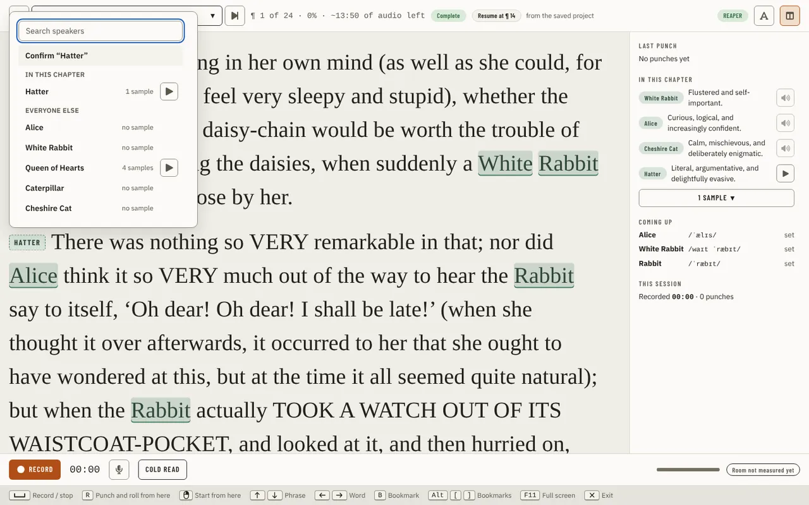

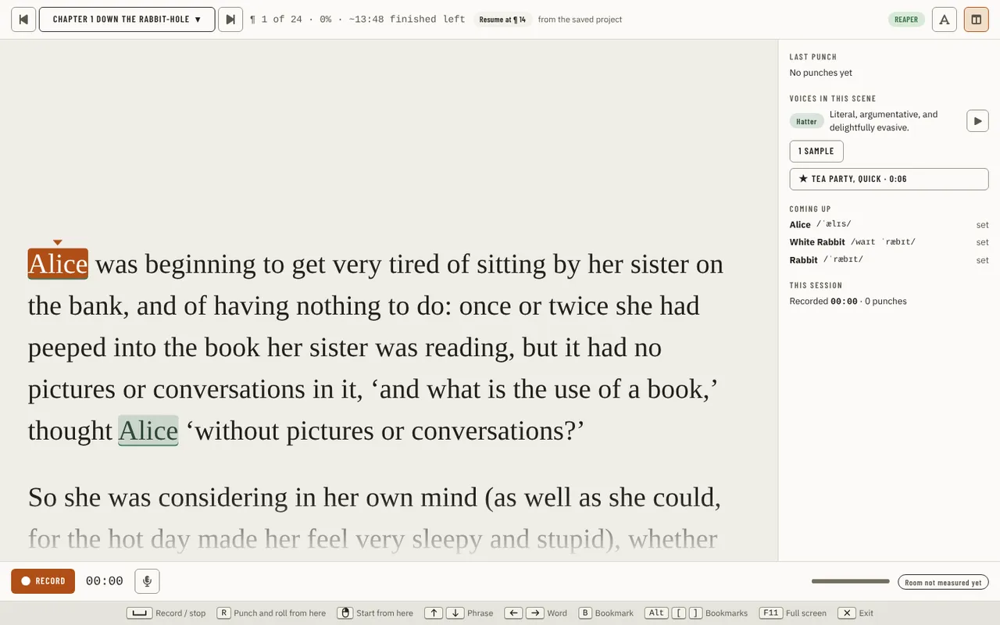

A sample plays through the computer's own speakers or headphones, never through the DAW, and it does not move the text or REAPER's cursor. Only one plays
at a time, and playing another stops the first. While the text is following your voice, listening pauses for the sample: the Booth asks the session to
pause, starts the sound about a third of a second later, and takes the pause back a third of a second after the sample ends or is stopped, with the note
**Listening paused while a voice sample plays**. A session you paused yourself stays paused. If you press Resume while a sample plays, the Booth leaves it resumed.

A sample is refused, with a sentence, in two cases:

| Shown | What it means | What to do |
| --- | --- | --- |
| "Not while recording. Stop the take first." | A take is recording, and a sample through your speakers would be heard by the microphone. The play buttons are off, and their hint says so. | Stop the take. |
| "Can't tell whether a take is recording (last heard 12 s ago)." with **Check again** | The DAW has gone quiet, so the Booth cannot tell whether it is recording. | Press **Check again**, or look in the DAW. |

A sample whose audio file is missing is listed with **Audio file missing** and does not play; the Story Bible says what to do. If a sample cannot be loaded, it
stops with a message.

**V** plays the primary sample of whoever speaks the phrase the reading is on, with no need to open the picker; a phrase with no quotation is Narration's. Press **V**
again to stop it. It plays nothing and says why in a message when that speaker has no sample ("No voice sample for Alice yet. Mark one in Editing."), when the phrase's
speaker is not known yet ("Choose who speaks this line first: press its speaker chip."), or during a take. **Esc** stops a sample that is playing; the next **Esc**
leaves the Booth, as it always did. The key is in the shortcut sheet and in **Settings > Keyboard** under Booth, where you can change it.

When the Booth opens, it loads the primary samples of the characters who speak in the chapter, and Narration's, in the background, so the first press does not wait
for the file; nothing plays by itself, and nothing is loaded while a take records.

## Bookmarks

The chapter's [bookmarks](script.md) show as ribbons in the right margin of the text, beside their words; hover one for its label
and note, and click it to edit it. A bookmark whose line changed since it was made is a warning mark at the top of the margin.
**B** bookmarks the word you are on, with **Undo** on the message. **Alt+]** and **Alt+[** move to the next and previous bookmark,
into another chapter when needed; during a take they move only within the chapter, and a bookmark in another chapter waits until you stop recording. Right-click a ribbon for **Edit bookmark** and **Delete bookmark**.

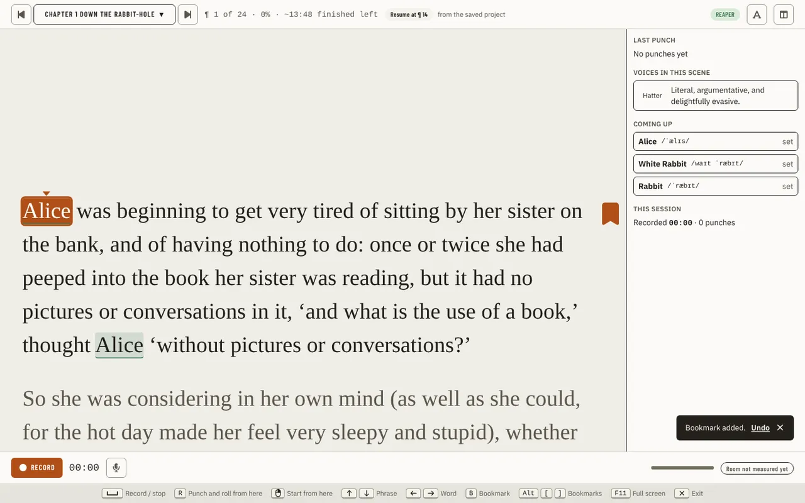

## A pickup session

**Open N in Booth** on [Pickups](pickups.md#pickup-session) opens the Booth on the chosen lines, at the first line's chapter. A
**Pickups · N open** chip on the top bar counts the lines still open, and the side panel lists them first, each with its chapter
and time on a card of its own: a chip says **Open** or **Recorded**, and the line you are on is framed. Click a line, or press **N** and **Shift+N**, to go to the next or previous one, in another
chapter when needed (not during a take). A line the recording check found is tagged **Automatic**; dismissing it removes it from
[Pickups](pickups.md) as well.

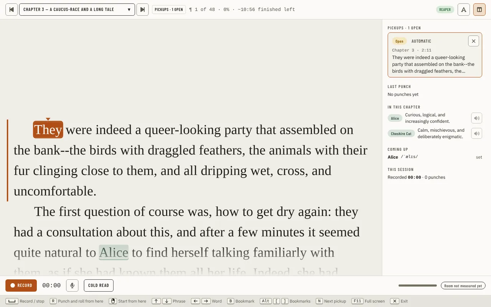

When a take stops, the lines it read over are marked recorded, and the message says how many ("Take saved · 2 pickups marked
recorded") with **Undo**.

## Suspected lines

While you read, the Booth marks places where listening suspects something went differently from the script, such as skipped
words or a restart. They are listed in the side panel as cards, a chip naming what was suspected above the line, where **Dismiss** removes one from the list. Every
one is only suspected: Transcript Compare over the recording is the authority.

## The credits

The chapter menu also offers **Opening credits** first and **Closing credits** last, when your credit template library
([Settings, Credits](settings.md#credits)) has an opening or a closing template. The text is the first template of each kind filled
in with the project's values, exactly as Settings previews it. If a value is missing, for example no narrator name yet, the
placeholder shows in brackets (such as [Narrator]) and a chip on the top bar says how many tokens have no value; it opens the
Credits settings. You can still record.

If the address asks for credits that have no template (for example an old link to the closing credits after the closing template was
deleted), the Booth shows a panel instead of text: **The closing credits are not set up**, with **Set up credits in Settings** and
**Back to the chapters**, which opens [Script](script.md), the chapter list, as Escape does with a chapter open. A link to a chapter the book no longer has shows the
same panel with **Back to the chapters**. An address the app cannot read at all, or one that names a chapter or line the book lacks, shows "This link could not be opened" with **Open Booth** and **Go to Production**; Escape leaves it as it leaves the Booth: for [Pickups](pickups.md) when the link still names pickups ("Open 3 in Booth"), otherwise for [Script](script.md).

If the book's chapters cannot be read when the Booth opens, it shows "This page could not be loaded" with the reason and **Retry**; Retry shows the Booth's grey blocks again while it reads, then the page or the reason again. **Leave the Booth** beside it goes back (to [Script](script.md), or to [Pickups](pickups.md) for a pickup session). Escape does the same, both from that panel and while the grey blocks are showing.

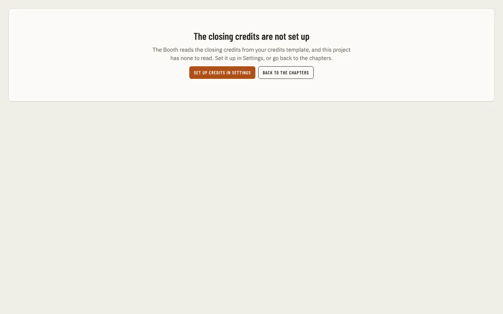

## Companion mode

The Companion is a narrow panel pinned beside your DAW. Open it with **Open Companion** in the jump menu or with `Ctrl+Alt+C`: the
reading session, with REAPER's playhead in its header, the script in its own scroll box, the reading controls and the hotkeys
that work while the panel has focus. **Full app** (or Escape twice) brings the Booth back on the same chapter. **Pickups** in the
panel shows the [Pickups](pickups.md) list: how many are left and the one you last jumped to. The note at the playhead has its
place in the panel and is coming later.
While its chapters are being read, the panel shows its title and grey blocks, and if the credits you asked for have no text it opens the Booth instead.

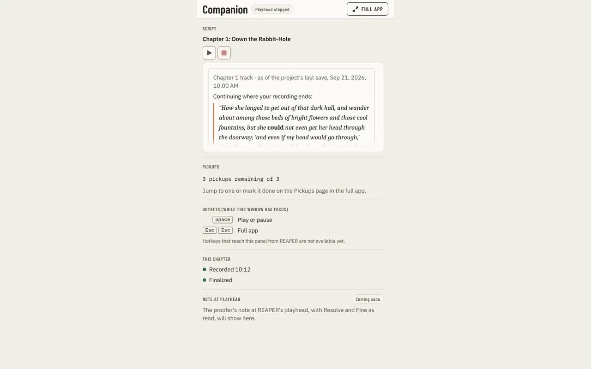

## Leaving the Booth

Escape (when nothing is open on top of the Booth) takes you to Script. While a take is recording, every way out asks first
(Escape, Back, Forward, the setup chip, a link to another chapter): "Stop recording?" says the DAW is recording and leaving
stops it. The take is held while the question is open. Focus opens on **Keep recording**, so Enter stays; **Stop and leave** stops the recording and then leaves. When the question closes, focus is where it was before it opened, so Enter never moves you to another chapter mid-take. If the DAW was already recording
when you came in, the Booth did not start that take and does not stop it, and the question says so.

---

[← Story Bible](story-bible.md) · [Index](README.md) · [Editing →](editing.md)
